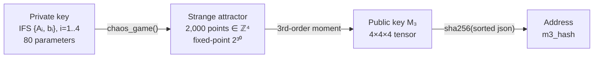
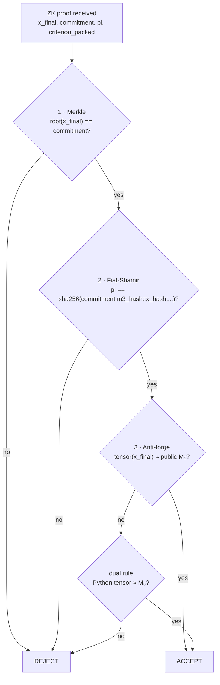
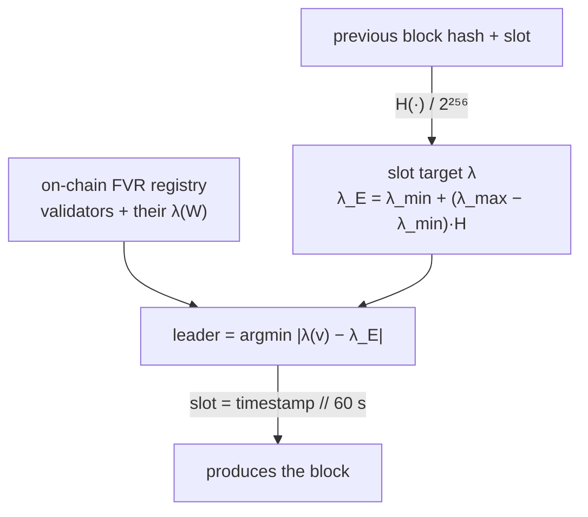
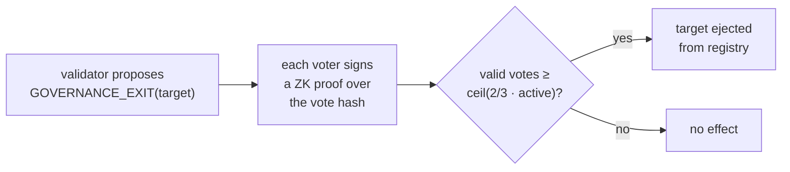
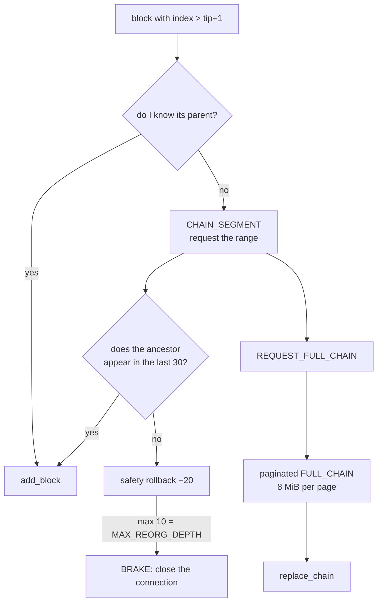

<!--
  Metriplex Protocol — Technical Whitepaper
  Copyright (c) 2025-2026 NTellezM (Nelson Tellez)
  Licensed under Creative Commons Attribution 4.0 International (CC BY 4.0)
  https://creativecommons.org/licenses/by/4.0/

  Attribution required: cite as NTellezM, Metriplex Protocol (2025),
  https://github.com/NTellezM/Metriplex
-->

# Metriplex Protocol — Technical Whitepaper

**Version 3.0 · September 2026**
*Order from chaos*

> [!NOTE]
> **On this revision**
> Version 3.0 updates the whitepaper to match what runs in production today. Since
> v2.0, consensus stopped electing leaders by a modulo over each node's local peer
> list and now uses the **Lyapunov distance** over an on-chain validator registry;
> the ZK proof uses the **complete attractor** (2,000 points, error 0); emission is
> **convergent by geometry**, not capped by an arbitrary number; and governance
> ejects validators by **ZK-signed vote**. What v2.0 described as future "Phase 2 /
> Fractal BFT" is now implemented. A Spanish edition is at `docs/whitepaper_es.md`.

---

## Abstract

Metriplex is a Layer 1 blockchain that replaces elliptic curve cryptography with
**fractal geometry** as the foundation for identity. Each account is a unique
strange attractor derived from a private Iterated Function System (IFS) in ℝ⁴.
Transaction validity is proven through a composite geometric criterion (c1–c8)
evaluated against this attractor, making forgery equivalent to solving the
**Inverse IFS Problem (IIFSP)** — conjectured to be computationally hard in the
average case and structurally resistant to Shor's quantum algorithm.

Everything else is built on that one primitive: consensus elects each block's
producer by a dynamic property of the attractor (its Lyapunov exponent),
governance votes are ZK identity proofs, and monetary emission converges by the
mathematical stability of the IFS. **One primitive, three uses: identity,
consensus, and money share the same geometry.**

---

## 1. The Identity Problem in Traditional Blockchains

In Bitcoin, Ethereum, and most existing blockchains, account identity derives
from elliptic curve cryptography (ECDSA or EdDSA). A private key is a 256-bit
integer; the public key is a point on a curve; the address is a hash of that
point. Three fundamental limitations:

1. **Dimensional poverty** — identity is a 1-dimensional object (a number). Two
   accounts differ only numerically, never in shape.
2. **Quantum vulnerability** — Shor's algorithm breaks ECDSA in polynomial time
   on a quantum computer.
3. **No structural binding** — the private key has no mathematical relationship
   to the space in which transactions operate.

Metriplex addresses all three by grounding identity in the geometry of fractal
attractors — objects with no known group structure exploitable by quantum
period-finding, and intrinsically bound to the parameters that define them.

---

## 2. Fractal Identity



### 2.1 The IFS Private Key

A Metriplex private key is a set of *n* affine contractions in ℝᵈ:

```
K_priv = { (Aᵢ, bᵢ) }   i = 1..n
  Aᵢ ∈ ℝᵈˣᵈ   with spectral radius ρ(Aᵢ) ∈ [0.30 , 0.70]
  bᵢ ∈ ℝᵈ
  det(Aᵢ) > 0                    (orientation-preserving — rule R1)
  ‖φ₃_ref‖ > ε_sym               (minimum asymmetry — rule R2)
  n ≤ ⌊C(d+2,3)/3⌋               (Kruskal uniqueness bound)
```

With production parameters (n=4, d=4), these conditions guarantee that the IFS
has a **unique strange attractor** μ_Q, the invariant measure of the system. The
constraint ρ(Aᵢ) ∈ [0.30 , 0.70] is the key that reappears in consensus and
emission: it bounds the Lyapunov exponent to a negative range.

### 2.2 The M₃ Public Key

The public key is the **third-order moment tensor** of the attractor:

```
M₃ = E_μ[(x − μ̂) ⊗ (x − μ̂) ⊗ (x − μ̂)]
```

computed via the chaos game algorithm. The Kruskal rank condition guarantees
that M₃ uniquely identifies the IFS: no two distinct systems produce the same
tensor.

> [!WARNING]
> **Rust is the reference, not an optimization**
> The tensor is computed in the Rust extension `metriplex_core`. The Python
> fallback does **not** produce a bit-identical result (they diverge by up to
> ~3.3e8). This is why startup aborts if Rust is missing: a node that computes
> differently validates differently and falls out of consensus, and a key made
> with the wrong path is born with its balance frozen. This is not theoretical —
> it happened to a real validator (node3) — and motivated the dual rule in §3.3.

### 2.3 Security Reduction

Signature security reduces to the hardness of the **Inverse IFS Problem
(IIFSP)**: given M₃, find a set {(Aᵢ, bᵢ)} that produces it. By the
Blum–Luby–Rubinfeld self-reduction theorem (BLR93), average-case hardness
implies worst-case hardness, giving a formal security foundation.

### 2.4 The Tensor Glyph — the Public Key Made Visible

M₃ is a 4×4×4 array of 64 values encoding the third-order geometry of the
attractor. Unlike a 256-bit integer, it has **intrinsic visual structure**. The
*Tensor Glyph* projects the tensor's first three slices onto the RGB channels of
a canvas via bilinear interpolation, producing a continuous, deterministic color
field.

Properties: **deterministic** (same M₃ → same image), **unique** (by
Kruskal–Comon, no two valid IFS share an M₃), **non-reversible** (the image
reconstructs neither M₃ nor the IFS), and **public** (it leaks nothing of the
private key). It replaces the QR code in the wallet and is the avatar of each
fractal identity.

---

## 3. The Zero-Knowledge Proof (ZK)

Every transaction includes a proof that the sender knows an IFS whose attractor
satisfies eight simultaneous criteria, calibrated at key generation and
published as parameters.

| Criterion | Detects |
|---|---|
| c1 Δ_AS | non-self-similar distributions |
| c2 Var | concentration / centroid attacks |
| c3 Frac | fragment loss |
| c5 Skew | reflection, rotation |
| c6 Disp | discrete / clustered distributions |
| c7 Inv | translation attacks |
| c8 Ratio | fixed-point attacks |

### 3.1 The Complete Attractor (N_PROOF = 2000)

> [!CAUTION]
> **Lesson from the forgery incident**
> v2.0 sampled **100 points** of the attractor for the proof. Under subsampling,
> the empirical tensor of `x_final` does **not** reproduce the public M₃: the
> third moment has enormous variance and a legitimate proof's error was the same
> order of magnitude as a forgery's. The anti-forge check was useless.
>
> Today `N_PROOF = 2000`: the trace `x_final` **is** the complete attractor, and
> the empirical tensor reproduces M₃ with **error 0**. The cost was quintupling
> block size (~98 KB), which in turn forced the memory and network hardening in
> §6. Correct security had a real operational price.

### 3.2 Three-Step Verification



1. **Commitment (Merkle).** The trace `x_final` must generate the declared Merkle
   root. Binds the proof to a concrete geometry without revealing the IFS.
2. **Fiat-Shamir seal.** The scalar `pi` ties the commitment, the sender's
   `m3_hash`, and the `tx_hash`. Prevents reusing a proof on another transaction
   or key.
3. **Anti-forge (the core).** The empirical tensor of `x_final` is recomputed and
   compared to the declared public key. Without the victim's attractor there is
   no `x_final` that yields their tensor.

### 3.3 Relative Margin and Dual Rule

Step 3 allows a margin. The old version used an **absolute** margin (2·2³⁰) that
exceeded the tensor magnitude ~22×: any key fell within any other's margin —
i.e. it did **not distinguish keys**. From `ZK_TOLERANCE_ACTIVATION` the margin
is **relative** (1% of the tensor magnitude): legitimate proofs give error 0 and
a forgery with a different key is around 100%.

The **dual rule** (from `DUAL_TENSOR_ACTIVATION`): if the Rust tensor does not
match, the Python tensor is tried with the same margin. These are two strict
equalities, not a wider margin — forgery still requires knowing the attractor. It
exists for identities created with the Python path (§2.2) without opening any
hole.

---

## 4. Consensus — Fractal Validator Registry (FVR)

> [!NOTE]
> **This replaces the v2.0 consensus**
> v2.0 elected leaders with `validators[sha256(prev_hash+slot) % |validators|]`,
> computed over each node's **local** list. If two nodes saw different lists they
> elected different leaders and forked (this happened on 2026-05-18). The FVR
> fixes it at the root: the validator list lives **on-chain** and the leader is
> chosen by an attractor property, not a list index.

### 4.1 Election by Lyapunov Distance



Each validator has a **Lyapunov exponent** λ(W) = (1/n)·Σ log ρ(Aᵢ), derived
from its IFS and bounded to [log 0.30 , log 0.70] by rule R1. For each slot a
target λ_E is derived from the previous block hash, and **the validator whose λ
is closest to the target wins**. No work (PoW), no stake lottery: the turn is
decided by the geometry of the attractor. The slot lasts
`BLOCK_TIME_SECONDS = 60`.

Because every node reads the **same** on-chain registry and the **same** previous
hash, every node computes the same leader. The local-list divergence that caused
forks disappears by construction.

### 4.2 Verifiable Authorship

The block includes the coinbase signed with the leader's ZK proof over the block
content (`producer_hash`). Any node verifies authorship without trusting a PKI:
the signature is the same ZK primitive from §3, bound to the registered leader's
M₃. `_check_block_coinbase` additionally requires the coinbase recipient to be
the elected leader of the slot.

---

## 5. Validator Registry and Governance

The FVR registry is the on-chain validator list. It changes only through
ZK-signed protocol operations (from `PROTOCOL_SIG_ACTIVATION`):

- **`VALIDATOR_REGISTER`** — join. Requires locking the stake in the custody
  vault (`STAKE_VAULT_M3_HASH`) and an unregistered identity.
- **`VALIDATOR_EXIT`** — voluntary leave. Removes the validator from the set;
  does not touch balances.
- **`VALIDATOR_UPDATE`** — updates endpoint / λ.
- **`VALIDATOR_GOVERNANCE_EXIT`** — ejection by vote.

### 5.1 Ejection by ZK Vote



Each vote is a **miniature ZK proof**: declaring the public `m3_hash` is not
enough, one must sign with the real attractor. A single attestation proves at
once **identity** (the signer possesses the IFS), **authorship** (it was
generated by the key holder, not a copy), and **membership** (the M₃ is in the
registry). Stealing a public key does not suffice to vote: it would require
solving the IIFSP.

> [!WARNING]
> **The anti-forge applies here too**
> Votes and the P2P handshake previously used the old absolute tolerance, which
> did not distinguish keys: an attacker could sign a vote on behalf of any
> validator using their own attractor. From `GOVERNANCE_STRICT_ACTIVATION` votes
> use the relative margin + dual rule (a consensus change, by height); the
> handshake, not being consensus, uses the strict mode directly.

---

## 6. Synchronization and Fork Resolution

A node that receives a block with index above its tip+1 requests the missing
segment. Resolving a deep fork sends the competing history.



With `N_PROOF = 2000` each block weighs ~98 KB and the competing history (201
blocks) is about **19.7 MB**. This forced three defenses, all born from real
incidents:

- **32 MiB message cap** — it was 16 MiB, and the `FULL_CHAIN` was rejected, the
  node could not find the ancestor, and it entered a cascade.
- **Paginated `FULL_CHAIN`** — split into 8 MiB pages, which the receiver
  reassembles in order with a bounded, expiring buffer.
- **Cascade brake** — at most `MAX_ROLLBACKS_SEGURIDAD = 10` consecutive safety
  rollbacks (10 × 20 = 200 = `MAX_REORG_DEPTH`); beyond that it closes the
  connection and requires manual intervention rather than erasing more chain.

---

## 7. Convergent Emission

Metriplex has no arbitrary supply cap: the limit **emerges from geometry**.

```
emission(n) = R₀ · e^(λ_mean · n / T_scale)
  T_scale ≈ 7.06 million blocks (calibration constant)
  λ_mean  = mean of the validator set's λ(W) (dynamic)
  R₀      = |λ_mean| / T_scale
```

Since every valid IFS satisfies ρ(Aᵢ) ∈ [0.30 , 0.70], we always have λ_mean < 0,
so emission decays to zero and supply **converges**:

```
Supply(∞) = R₀ · T_scale / |λ_mean|  <  ∞   (guaranteed by IFS stability)
```

With the current geometry (λ_mean ≈ −0.62) supply tends to ~21 million MPX. More
validator diversity → more negative λ_mean → larger monetary capacity (e.g. ~34M
at λ_mean = −1.0). Each block's reward is distributed by **Voronoi fraction** in
λ-space: each validator earns in proportion to its geometric "territory."

> [!NOTE]
> **Design coherence**
> The same quantity — the attractor's Lyapunov exponent — governs identity,
> elects the consensus leader, and sets the monetary capacity. Identity geometry
> = consensus geometry = money geometry.

After emission, validators live on transaction fees.

---

## 8. EVM Bridge

Lock-and-mint / burn-and-release architecture against Ethereum (Base):

**Native → Ethereum:** the user sends MPX to the vault and includes
`target_eth_address` in the payload; the relayer detects the TX and calls
`mint(to, amount)` on the ERC-20.

**Ethereum → Native:** the user calls `burnForNative(amount, recipient)` on the
contract, with `recipient` = JSON serialization of their M₃ tensor; the relayer
detects the `BridgeBurn` event and submits a ZK-signed release TX from the vault.

The ERC-20 is a **liquidity layer**; the canonical asset lives on L1. The 1:1
relationship will evolve with the L1/ERC-20 supply ratio as convergent supply
exceeds the initial 21M.

---

## 9. Activation by Height

Any change affecting validation is introduced by **activation height**, never by
deploy time, and requires **all nodes to be upgraded before** that height. This
is what lets consensus rules change on a live network without forking it.

| Height | Constant | What changes |
|---|---|---|
| 107342 | `PROTOCOL_SIG_ACTIVATION` | ZK signature on protocol operations |
| 109000 | `TX_V2_ACTIVATION` | signed envelope with `chain_id` and nonce |
| 111900 | `ZK_TOLERANCE_ACTIVATION` | relative 1% margin — binds the proof to the key |
| 123000 | `DUAL_TENSOR_ACTIVATION` | accepts the Rust **or** the Python tensor |
| 124000 | `GOVERNANCE_STRICT_ACTIVATION` | governance votes with relative margin + dual |

---

## 10. Network Status and Roadmap

**Today:** two validators in Germany (node1 on Hetzner, node3 in Falkenstein),
ZK-authenticated P2P mesh, 60-second block time, live EVM bridge, web wallet and
Chrome extension with the Tensor Glyph.

| Milestone | Status |
|---|---|
| L1 core (IFS identity, ZK criterion, consensus, persistence) | ✅ |
| EVM bridge (relayer + ERC-20, Base) | ✅ |
| FVR consensus by Lyapunov + on-chain registry | ✅ |
| Governance by ZK vote (2/3) | ✅ |
| Tensor Glyph + browser extension | ✅ |
| Cryptographic core in Rust (`metriplex_core`) | ✅ |
| Network hardening (pagination, brake, 32 MiB cap) | ✅ |
| Definitive memory (RAM window ~200 blocks) | 🔜 |
| Disk pruning (move `signature_data` out of the block hash) | 🔜 |
| Security audit + arXiv | 🔜 |

---

## Appendix — quick glossary

- **IFS** — Iterated Function System; the set {(Aᵢ, bᵢ)} that is the private key.
- **Attractor** — the fractal figure the IFS generates; its shape is the identity.
- **M₃** — third-order tensor of the attractor; the public key.
- **λ(W)** — Lyapunov exponent of the IFS; governs consensus and emission.
- **FVR** — Fractal Validator Registry, on-chain.
- **IIFSP** — Inverse IFS Problem; its hardness is the security foundation.
- **Tensor Glyph** — continuous color image derived from M₃; the account's avatar.

---

*Metriplex Protocol — Order from chaos*
