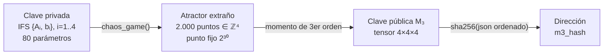
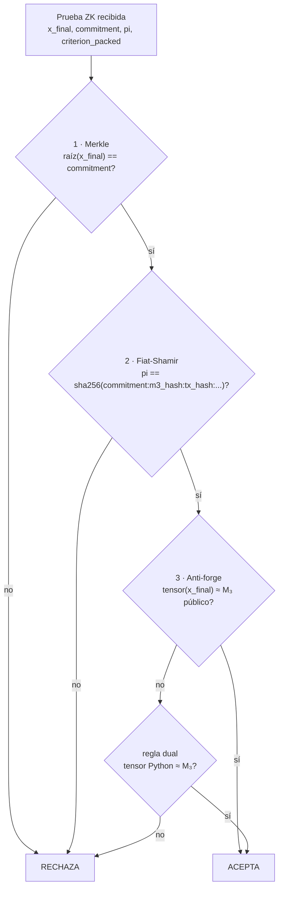
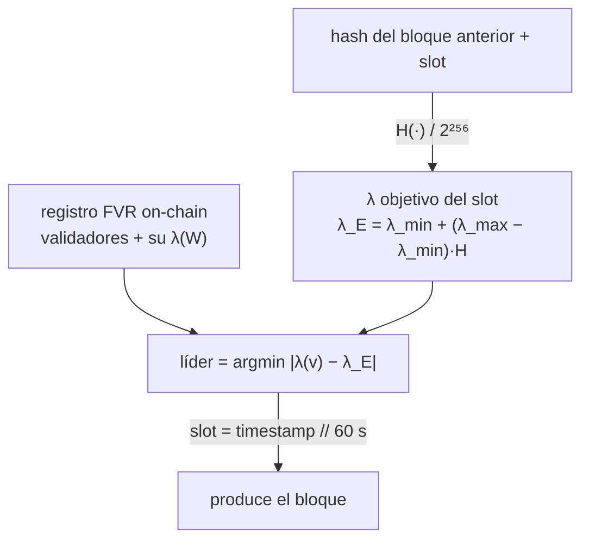
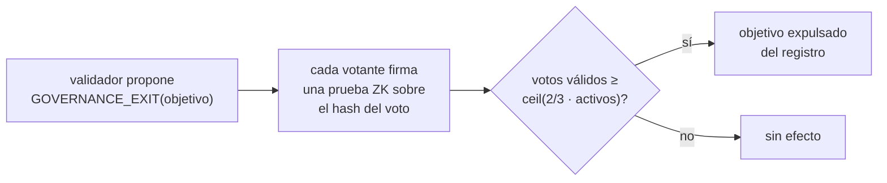
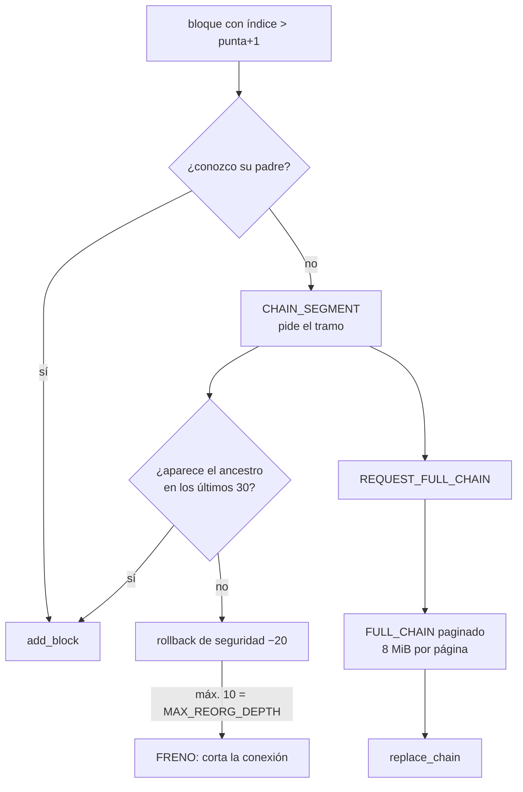

<!--
  Metriplex Protocol — Whitepaper (español)
  Copyright (c) 2025-2026 NTellezM (Nelson Tellez)
  Licensed under Creative Commons Attribution 4.0 International (CC BY 4.0)
  https://creativecommons.org/licenses/by/4.0/

  Atribución requerida: citar como NTellezM, Metriplex Protocol (2025),
  https://github.com/NTellezM/Metriplex

  Traducción y revisión en español del docs/whitepaper.md (v2.0).
-->


# Metriplex Protocol — Whitepaper (ES)

> [!NOTE]
> **Sobre esta versión**
> Traducción al español y **revisión técnica** de la v2.0 (mayo 2026). Se pone al
> día con lo que hoy corre en producción: el consenso dejó de elegir líder por
> módulo y pasó a la **distancia de Lyapunov** sobre un registro de validadores
> on-chain; la prueba ZK usa el **atractor completo** (2.000 puntos, error 0); la
> emisión es **convergente** por geometría, no por un tope arbitrario; y la
> gobernanza expulsa validadores por **votación ZK**. Lo que en la v2.0 era la
> "Fase 2 / Fractal BFT" a futuro, hoy está implementado. Mapa vivo del sistema:
> `CLAUDE.md` y el mapa del proyecto.

---

## Resumen

Metriplex es una blockchain de capa 1 que sustituye la criptografía de curva
elíptica por **geometría fractal** como base de la identidad. Cada cuenta es un
atractor extraño único, derivado de un Sistema de Funciones Iteradas (IFS)
privado en ℝ⁴. La validez de una transacción se prueba mediante un criterio
geométrico compuesto (c1–c8) evaluado contra ese atractor, de modo que
falsificar una firma equivale a resolver el **Problema Inverso del IFS (IIFSP)**
—conjeturado difícil en el caso promedio—.

Sobre esa misma primitiva se construye todo lo demás: el consenso elige al
productor de cada bloque por una propiedad dinámica del atractor (su exponente
de Lyapunov), los votos de gobernanza son pruebas ZK de identidad, y la emisión
monetaria converge por la estabilidad matemática del IFS. **Una primitiva, tres
usos: identidad, consenso y moneda comparten la misma geometría.**

---

## 1. El problema de la identidad

En Bitcoin, Ethereum y casi toda blockchain, la identidad de una cuenta nace de
la criptografía de curva elíptica. La clave privada es un entero de 256 bits; la
pública, un punto en la curva; la dirección, un hash de ese punto. Tres límites
de fondo:

1. **Pobreza dimensional** — la identidad es un objeto de una dimensión (un
   número). Dos cuentas solo se distinguen numéricamente, nunca por su forma.
2. **Vulnerabilidad cuántica** — el algoritmo de Shor rompe ECDSA en tiempo
   polinómico sobre un computador cuántico.
3. **Sin vínculo estructural** — la clave privada no guarda relación matemática
   con el espacio donde ocurren las transacciones.

Metriplex ataca los tres a la vez dándole a la identidad **estructura
geométrica**.

---

## 2. Identidad fractal



### 2.1 La clave privada IFS

Una clave privada Metriplex es un conjunto de *n* contracciones afines en ℝᵈ:

```
K_priv = { (Aᵢ, bᵢ) }   i = 1..n
  Aᵢ ∈ ℝᵈˣᵈ   con radio espectral ρ(Aᵢ) ∈ [0,30 , 0,70]
  bᵢ ∈ ℝᵈ
  det(Aᵢ) > 0                    (preserva orientación — regla R1)
  ‖φ₃_ref‖ > ε_sym               (asimetría mínima — regla R2)
  n ≤ ⌊C(d+2,3)/3⌋               (cota de unicidad de Kruskal)
```

Con los parámetros de producción (n=4, d=4), estas condiciones garantizan que el
IFS tiene un **único atractor extraño** μ_Q, la medida invariante del sistema.
La restricción ρ(Aᵢ) ∈ [0,30 , 0,70] es la clave que luego reaparece en el
consenso y en la emisión: acota el exponente de Lyapunov a un rango negativo.

### 2.2 La clave pública M₃

La clave pública es el **tensor de momento de tercer orden** del atractor:

```
M₃ = E_μ[(x − μ̂) ⊗ (x − μ̂) ⊗ (x − μ̂)]
```

calculado con el algoritmo del *chaos game*. La condición de rango de Kruskal
garantiza que M₃ identifica el IFS de forma única: no hay dos sistemas distintos
que produzcan el mismo tensor.

> [!WARNING]
> **Rust es la referencia, no una optimización**
> El tensor se calcula en la extensión Rust `metriplex_core`. La ruta Python de
> respaldo **no da bit a bit el mismo resultado** (difieren hasta ~3,3e8). Por
> eso el arranque aborta si falta Rust: un nodo que calcule distinto valida
> distinto y queda fuera de consenso, y una clave creada con la ruta equivocada
> nace con el saldo inmovilizado. Esto no es teórico —le pasó a un validador
> real (nodo3)— y motivó la regla dual de §3.3.

### 2.3 Reducción de seguridad

La seguridad de la firma se reduce a la dureza del **Problema Inverso del IFS
(IIFSP)**: dado M₃, hallar un conjunto {(Aᵢ, bᵢ)} que lo produzca. Por el
teorema de auto-reducción de Blum–Luby–Rubinfeld (BLR93), la dureza en el caso
promedio implica dureza en el peor caso, lo que da una base formal a la
seguridad.

### 2.4 El Glifo Tensorial — la clave pública hecha visible

M₃ es una matriz 4×4×4 de 64 valores que codifican la geometría de tercer orden
del atractor. A diferencia de un entero de 256 bits, **tiene estructura visual
intrínseca**. El *Glifo Tensorial* proyecta las tres primeras "rebanadas" del
tensor sobre los canales RGB de un lienzo, con interpolación bilineal, y produce
un campo de color continuo y determinista.

Propiedades: **determinista** (mismo M₃ → misma imagen), **único** (por
Kruskal–Comon, no hay dos IFS válidos con el mismo M₃), **no reversible** (la
imagen no reconstruye M₃ ni el IFS) y **público** (no filtra nada de la clave
privada). Sustituye al código QR en la billetera y es el avatar de cada
identidad fractal.

---

## 3. La prueba de conocimiento cero (ZK)

Cada transacción incluye una prueba de que el emisor conoce un IFS cuyo atractor
satisface ocho criterios simultáneos. Los criterios se calibran al generar la
clave y se publican como parámetros.

| Criterio | Detecta |
|---|---|
| c1 Δ_AS | distribuciones no auto-similares |
| c2 Var | ataques de concentración / centroide |
| c3 Frac | pérdida de fragmentos |
| c5 Skew | reflexión, rotación |
| c6 Disp | distribuciones discretas / en clúster |
| c7 Inv | ataques de traslación |
| c8 Ratio | ataques de punto fijo |

### 3.1 El atractor completo (N_PROOF = 2000)

> [!CAUTION]
> **Lección del incidente de falsificación**
> La v2.0 muestreaba **100 puntos** del atractor para la prueba. Con submuestreo,
> el tensor empírico de `x_final` **no reproduce** el M₃ público: el tercer
> momento tiene varianza altísima y el error de una prueba legítima era del mismo
> orden que el de una falsificación. El chequeo anti-forge quedaba inútil.
>
> Hoy `N_PROOF = 2000`: la traza `x_final` **es** el atractor completo, y el
> tensor empírico reproduce el M₃ con **error 0**. El coste fue quintuplicar el
> peso del bloque (~98 KB), lo que a su vez obligó a endurecer memoria y red
> (§7). La seguridad correcta tuvo un precio operativo real.

### 3.2 Verificación en tres pasos



1. **Compromiso (Merkle).** La traza `x_final` debe generar la raíz de Merkle
   declarada. Ata la prueba a una geometría concreta sin revelar el IFS.
2. **Sello Fiat-Shamir.** El escalar `pi` liga el compromiso, el `m3_hash` del
   emisor y el `tx_hash`. Impide reusar una prueba en otra transacción o clave.
3. **Anti-forge (el corazón).** Se recalcula el tensor empírico de `x_final` y
   se compara con la clave pública declarada. Sin el atractor de la víctima no
   existe un `x_final` que dé su tensor.

### 3.3 Margen relativo y regla dual

El paso 3 admite un margen. La versión antigua usaba un margen **absoluto**
(2·2³⁰) que superaba ~22× la magnitud del tensor: cualquier clave caía dentro
del margen de cualquier otra, es decir, **no distinguía claves**. Desde la
altura `ZK_TOLERANCE_ACTIVATION` el margen es **relativo** (1 % de la magnitud
del tensor): las pruebas legítimas dan error 0 y una falsificación con otra
clave ronda el 100 %.

La **regla dual** (desde `DUAL_TENSOR_ACTIVATION`): si el tensor de Rust no
coincide, se prueba también el de Python con el mismo margen. Son dos igualdades
estrictas, no un margen más ancho — falsificar sigue exigiendo conocer el
atractor. Existe para las identidades creadas con la ruta Python (§2.2) sin
abrir ningún hueco.

---

## 4. Consenso — Registro Fractal de Validadores (FVR)

> [!NOTE]
> **Esto reemplaza al consenso de la v2.0**
> La v2.0 elegía líder con `validators[sha256(prev_hash+slot) % |validadores|]`,
> calculado sobre la lista **local** de cada nodo. Si dos nodos veían listas
> distintas, elegían líderes distintos y bifurcaban (ocurrió el 18-may-2026). El
> FVR resuelve esto de raíz: la lista de validadores vive **on-chain** y el
> líder se elige por una propiedad del atractor, no por un índice de lista.

### 4.1 Elección por distancia de Lyapunov



Cada validador tiene un **exponente de Lyapunov** λ(W) = (1/n)·Σ log ρ(Aᵢ),
derivado de su IFS y acotado en [log 0,30 , log 0,70] por la regla R1. Para cada
slot se deriva un objetivo λ_E del hash del bloque anterior, y **gana el
validador cuyo λ está más cerca del objetivo**. No hay trabajo (PoW) ni sorteo
por stake: el turno lo decide la geometría del atractor. El slot dura
`BLOCK_TIME_SECONDS = 60`.

Como todos los nodos leen el **mismo** registro on-chain y el **mismo** hash
anterior, todos calculan el mismo líder. La divergencia de listas locales que
causaba forks desaparece por construcción.

### 4.2 Autoría verificable

El bloque incluye la coinbase firmada con la prueba ZK del líder sobre el
contenido del bloque (`producer_hash`). Cualquier nodo verifica la autoría sin
confiar en una PKI: la firma es la misma primitiva ZK de §3, atada al M₃ del
líder registrado. `_check_block_coinbase` exige además que el receptor de la
coinbase sea el líder electo del turno.

---

## 5. Registro de validadores y gobernanza

El registro FVR es la lista on-chain de validadores. Se modifica solo con
operaciones de protocolo firmadas con ZK (desde `PROTOCOL_SIG_ACTIVATION`):

- **`VALIDATOR_REGISTER`** — alta. Exige bloquear el stake requerido en el vault
  de custodia (`STAKE_VAULT_M3_HASH`) y una identidad no registrada.
- **`VALIDATOR_EXIT`** — baja voluntaria. Saca al validador del set; no toca
  saldos.
- **`VALIDATOR_UPDATE`** — actualiza el endpoint / λ.
- **`VALIDATOR_GOVERNANCE_EXIT`** — expulsión por votación.

### 5.1 Expulsión por votación ZK



Cada voto es una **prueba ZK en miniatura**: no basta declarar el `m3_hash`
público, hay que firmar con el atractor real. Una sola atestación prueba a la
vez **identidad** (el firmante posee el IFS), **autoría** (la generó el dueño de
la clave, no una copia) y **pertenencia** (el M₃ está en el registro). Robar una
clave pública no basta para votar: haría falta resolver el IIFSP.

> [!WARNING]
> **El anti-forge también aquí**
> Los votos y el handshake P2P usaban antes la tolerancia absoluta antigua, que
> no distinguía claves: un atacante podía firmar un voto en nombre de cualquier
> validador con su propio atractor. Desde `GOVERNANCE_STRICT_ACTIVATION` los
> votos usan el margen relativo + regla dual (cambio de consenso, por altura); el
> handshake, que no es consenso, usa el modo estricto directamente.

---

## 6. Sincronización y resolución de forks

Un nodo que recibe un bloque con índice mayor a su punta+1 pide el tramo que le
falta. La resolución de un fork profundo envía el historial competitivo.



Con `N_PROOF = 2000` cada bloque pesa ~98 KB y el historial competitivo (201
bloques) ronda **19,7 MB**. Esto obligó a tres defensas, todas nacidas de
incidentes reales:

- **Tope de mensaje 32 MiB** — antes eran 16 MiB y el `FULL_CHAIN` se rechazaba,
  el nodo no encontraba el ancestro y entraba en cascada.
- **Paginación del `FULL_CHAIN`** — se parte en páginas de 8 MiB, que el receptor
  reensambla en orden con un buffer acotado y con caducidad.
- **Freno de la cascada** — como mucho `MAX_ROLLBACKS_SEGURIDAD = 10` rollbacks
  de seguridad seguidos (10 × 20 = 200 = `MAX_REORG_DEPTH`); superado, corta la
  conexión y pide intervención manual, en vez de seguir borrando cadena.

---

## 7. Emisión convergente

Metriplex no tiene un tope de suministro arbitrario: el límite **emerge de la
geometría** del sistema.

```
emisión(n) = R₀ · e^(λ_mean · n / T_scale)
  T_scale ≈ 7,06 millones de bloques (constante de calibración)
  λ_mean  = media de los λ(W) del set de validadores (dinámica)
  R₀      = |λ_mean| / T_scale
```

Como todo IFS válido cumple ρ(Aᵢ) ∈ [0,30 , 0,70], se tiene λ_mean < 0 siempre,
así que la emisión decae a cero y el suministro **converge**:

```
Suministro(∞) = R₀ · T_scale / |λ_mean|  <  ∞   (garantizado por la estabilidad del IFS)
```

Con la geometría actual (λ_mean ≈ −0,62) el suministro tiende a ~21 millones de
MPX. Más diversidad de validadores → λ_mean más negativo → mayor capacidad
monetaria (p. ej. ~34 M con λ_mean = −1,0). La recompensa de cada bloque se
reparte por **fracción de Voronoi** en el espacio λ: cada validador cobra en
proporción a su "territorio" geométrico.

> [!NOTE]
> **Coherencia del diseño**
> La misma cantidad —el exponente de Lyapunov del atractor— gobierna la
> identidad, elige al líder del consenso y fija la capacidad monetaria.
> Geometría de identidad = geometría de consenso = geometría de la moneda.

Tras la emisión, los validadores viven de las comisiones de transacción.

---

## 8. Puente EVM

Arquitectura lock-and-mint / burn-and-release contra Ethereum (Base):

**Nativo → Ethereum:** el usuario envía MPX al vault e incluye
`target_eth_address` en el payload; el relayer detecta la TX y llama a
`mint(to, amount)` en el ERC-20.

**Ethereum → Nativo:** el usuario llama `burnForNative(amount, destino)` en el
contrato, con `destino` = serialización JSON de su tensor M₃; el relayer detecta
el evento `BridgeBurn` y emite una TX de liberación firmada con ZK desde el
vault.

El ERC-20 es una **capa de liquidez**; el activo canónico vive en la L1. La
relación 1:1 evolucionará con la razón de suministro L1/ERC-20 a medida que el
suministro convergente supere los 21 M iniciales.

---

## 9. Endurecimiento por altura

Todo cambio que afecte a la validación entra por **altura de activación**, nunca
por el momento del despliegue, y exige que **todos los nodos estén actualizados
antes** de esa altura. Es lo que permite cambiar reglas de consenso en una red
viva sin bifurcarla.

| Altura | Constante | Qué cambia |
|---|---|---|
| 107342 | `PROTOCOL_SIG_ACTIVATION` | firma ZK en operaciones de protocolo |
| 109000 | `TX_V2_ACTIVATION` | sobre firmado con `chain_id` y nonce |
| 111900 | `ZK_TOLERANCE_ACTIVATION` | margen relativo 1 % — ata la prueba a la clave |
| 123000 | `DUAL_TENSOR_ACTIVATION` | acepta el tensor de Rust **o** el de Python |
| 124000 | `GOVERNANCE_STRICT_ACTIVATION` | votos de gobernanza con margen relativo + dual |

---

## 10. Estado de la red y hoja de ruta

**Hoy:** dos validadores (nodo1 en Finlandia, nodo3 en EE.UU. — ambos Hetzner),
malla P2P autenticada por ZK, bloque cada 60 s, puente EVM en vivo, billetera
web y extensión de Chrome con Glifo Tensorial.

| Hito | Estado |
|---|---|
| Núcleo L1 (identidad IFS, criterio ZK, consenso, persistencia) | ✅ |
| Puente EVM (relayer + ERC-20, Base) | ✅ |
| Consenso FVR por Lyapunov + registro on-chain | ✅ |
| Gobernanza por votación ZK (2/3) | ✅ |
| Glifo Tensorial + extensión de navegador | ✅ |
| Núcleo criptográfico en Rust (`metriplex_core`) | ✅ |
| Endurecimiento de red (paginación, freno, tope 32 MiB) | ✅ |
| Memoria definitiva (ventana en RAM ~200 bloques) | 🔜 |
| Poda en disco (sacar `signature_data` del hash del bloque) | 🔜 |
| Auditoría de seguridad + arXiv | 🔜 |

---

## Apéndice — glosario rápido

- **IFS** — Sistema de Funciones Iteradas; el conjunto {(Aᵢ, bᵢ)} que es la clave privada.
- **Atractor** — la figura fractal que el IFS genera; su forma es la identidad.
- **M₃** — tensor de tercer orden del atractor; la clave pública.
- **λ(W)** — exponente de Lyapunov del IFS; gobierna consenso y emisión.
- **FVR** — Registro Fractal de Validadores, on-chain.
- **IIFSP** — Problema Inverso del IFS; su dureza es la base de seguridad.
- **Glifo Tensorial** — imagen de color continua derivada de M₃; el avatar de la cuenta.

---

*Metriplex Protocol — Orden desde el caos*
